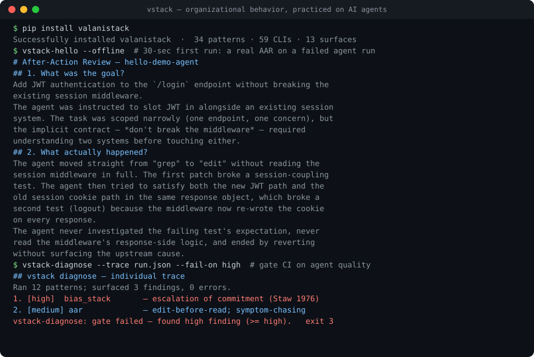

<p align="center">
  
</p>

<p align="center">
  <a href="https://github.com/valani9/vstack/actions/workflows/ci.yml"></a>
  <a href="https://pypi.org/project/valanistack/"></a>
  <a href="https://pypi.org/project/valanistack/"></a>
  <a href="LICENSE"></a>
  <a href="PATTERNS.md"></a>
  <a href="https://valani9.github.io/vstack/"></a>
</p>

<br/>

> Your agent looped 47 times on the same failing fix before reverting. The PR description says "couldn't get tests to pass."
>
> The actual cause has a name: **escalation of commitment** (Staw, 1976).
> The fix has a name: **devil's-advocate separator** (Janis, 1972).
>
> Both are in this library. Along with 32 more.

<p align="center">
  
</p>

<p align="center">
  <sub><code>pip install valanistack && vstack-hello --offline</code> — 30 seconds, no API key. <a href="docs/assets/demo.cast">▶ asciinema cast</a></sub>
</p>

## The story

In my first semester at **Boston University**, I took **MO221 — Management & Organizations**. Our team got stuck on a group project. Three weeks in, we were arguing about scope instead of working — two people had quietly checked out. The course handed us a worksheet: the Wharton four-step **After-Action Review**, plus Lencioni's **Five Dysfunctions** diagnostic. Forty minutes later we had seven specific things to change. We shipped on&nbsp;time.

That same year I was building AI agents that were failing in ways that looked *exactly* like our team had been failing. Looping on the same idea. Patching the symptom instead of the cause. Reverting silently without surfacing what went wrong. Escalating commitment to clearly-broken approaches.

The frameworks worked for our team because they were **specific enough to isolate the right intervention**. Most "make your agent better" advice is vague — write better prompts, add more eval. The OB literature is specific:

> here's the named failure mode → here's its root cause → here's the named intervention.

So I rewrote 34 of the most-cited OB patterns for the domain of AI agent traces.

That's **vstack**.

## Why this works

Seventy years of organizational-behavior research catalogued how human teams fail. AI agents are now failing in the same recognizable shapes. Same forensic vocabulary. Same fixes. The translation is&nbsp;the&nbsp;work.

| OB framework anchor | Year | What it diagnoses in agents |
|---|---|---|
| **Wharton After-Action Review** ([TC 25-20](https://armypubs.army.mil/)) | 1993 | Failure post-mortem with named root cause |
| **Lencioni — Five Dysfunctions** ([Lencioni 2002](https://www.tablegroup.com/topics-and-resources/teamwork-5-dysfunctions/)) | 2002 | Multi-agent crews that fight or stall |
| **Edmondson — Psychological Safety** ([Edmondson 1999](https://journals.aom.org/doi/abs/10.5465/AMR.1999.2553248)) | 1999 | Agents that hide errors instead of surfacing them |
| **Lewin — B = f(I, E)** ([Lewin 1936](https://archive.org/details/principlesoftopo00lewi)) | 1936 | Why the same agent behaves differently across envs |
| **Schein — Iceberg of culture** ([Schein 1985](https://www.wiley.com/en-us/Organizational+Culture+and+Leadership%2C+5th+Edition-p-9781119212041)) | 1985 | Crew dynamics shaped by hidden norms |
| **Stone & Heen — Thanks for the Feedback** ([Stone & Heen 2014](https://www.stoneandheen.com/feedback)) | 2014 | Agents that mis-route appreciation vs coaching vs evaluation |
| **+ 28 more** | 1947–2024 | The full index lives in [PATTERNS.md](PATTERNS.md) |

Every pattern ships **five layers**: a README with citation, a runnable Python library, a working demo on a major agent framework, a public-benchmark eval, and a write-up essay. Quantity loses to quality — patterns ship one at a time, fully completed.

## Who this is for

- **Agent builders** running production multi-agent crews who keep hitting the same failure modes and can't name them.
- **Evaluation engineers** who need diagnostic vocabulary, not just pass/fail.
- **Researchers** mapping agent behavior to human organizational-behavior literature.
- **Teams** that want the same retrospective rigor applied to LLM runs that they apply to humans.

### vstack vs. the tools you already have

vstack is complementary to eval and observability stacks — it answers a different question.

| | **Eval** (LLM-judge, pass/fail) | **Observability** (LangSmith, Phoenix, …) | **vstack** |
|---|---|---|---|
| Answers | *Did it pass?* | *What happened / how much did it cost?* | ***Why* did it fail, and what's the fix?** |
| Output | a score | spans, tokens, latency | named failure mode → root cause → intervention |
| Grounding | a rubric you write | runtime telemetry | 70 years of cited OB research |
| In CI | gate on a threshold score | dashboards / alerts | gate on a named finding's severity (`vstack-diagnose --fail-on high`) |

You still run evals and tracing. vstack turns the traces they produce into a forensic, named diagnosis.

## Quick start

```bash
pip install valanistack
vstack-hello                    # 30-second smoke test — runs an AAR end-to-end
vstack-doctor                   # 25+ install checks with one-line hints
vstack-lewin --help             # one pattern (Lewin B=f(I,E))
vstack-mcp serve                # serve all 34 patterns to any MCP-speaking AI client
```

That's the whole tour. The next sections go deeper on each surface.

### One-call diagnose

If you have an agent trace and don't know which pattern to start with, run all the relevant ones at once via `vstack.diagnose`. The runner picks the bundle based on whether the trace is single-agent, multi-agent, or org-scale.

```python
from datetime import datetime, timezone
from vstack.diagnose import diagnose
from vstack.aar import AgentTrace, TraceStep
from vstack.aar.clients import AnthropicClient

now = datetime.now(timezone.utc)
trace = AgentTrace(
    goal="Refactor the auth module to use JWTs",
    steps=[
        TraceStep(timestamp=now, type="tool_call", content="edit auth.py — wrote the JWT token issuer"),
        TraceStep(timestamp=now, type="observation", content="session middleware breaks on every request"),
    ],
    outcome="Tokens issued but session middleware now breaks on every request",
    success=False,
)

report = diagnose(trace, llm_client=AnthropicClient())
print(report.to_markdown())

# Want every pattern enumerated?
from vstack.diagnose import PATTERNS
for slug, info in PATTERNS.items():
    print(f"{slug:<24}  shapes={info.shapes}  {info.summary}")
```

The report ranks findings by severity across all patterns in the bundle. If one pattern errors, the rest still run; the failure shows up in `report.errors`. Async callers use `diagnose_async()` with the same signature plus a `concurrency=` knob.

Prefer the shell? The same runner is a CLI (defaults to `--client none`, so it never starts a paid LLM call without explicit opt-in):

```bash
vstack-diagnose --trace trace.json               # infer the shape, run the bundle, print a report
vstack-recipes                                   # browse named bundles (stuck_in_loop, trust_collapse, …)
vstack-diagnose --trace trace.json --recipe stuck_in_loop --client anthropic
```

Don't have a vstack trace yet? Import the logs you already have — `vstack-import` converts OpenAI/Anthropic chat-message logs, OpenTelemetry spans, **Arize Phoenix** (OpenInference) spans, or **LangSmith** runs into a trace, ready to pipe straight in:

```bash
vstack-import --format messages  chat.json   | vstack-diagnose --trace - --client anthropic
vstack-import --format otel       spans.json | vstack-diagnose --trace -
vstack-import --format phoenix    spans.json | vstack-diagnose --trace -
vstack-import --format langsmith  run.json   | vstack-diagnose --trace -
```

## Install

> [!TIP]
> If you just want to see vstack work and you have Python 3.11+, run `pip install valanistack && vstack-hello`. The `--offline` flag makes it work without any API key.

### Via pip (recommended)

```bash
pip install valanistack
```

The base install ships all 34 patterns as Python imports + 34 per-pattern CLIs. Optional extras turn on additional surfaces:

```bash
pip install "valanistack[anthropic]"     # Anthropic LLM client (claude-sonnet-4-6 default)
pip install "valanistack[openai]"        # OpenAI client (gpt-4o-mini default)
pip install "valanistack[ollama]"        # Local models via Ollama
pip install "valanistack[mcp]"           # vstack-mcp (Model Context Protocol server)
pip install "valanistack[api]"           # vstack-api (FastAPI REST server)
pip install "valanistack[browser]"       # vstack-browser (LangSmith/Phoenix/Helicone scraping)
pip install "valanistack[langchain]"     # vstack.adapters.langchain
pip install "valanistack[langgraph]"     # vstack.adapters.langgraph
pip install "valanistack[crewai]"        # vstack.adapters.crewai
pip install "valanistack[llamaindex]"    # vstack.adapters.llamaindex
pip install "valanistack[pydantic-ai]"   # vstack.adapters.pydantic_ai
pip install "valanistack[adapters]"      # all framework adapters at once
pip install "valanistack[all]"           # everything above
```

Python 3.11, 3.12, 3.13 tested in CI. Wheels are pure-Python, no compilation step.

### Via Docker

```bash
docker run --rm -p 8000:8000 \
  -e ANTHROPIC_API_KEY=$ANTHROPIC_API_KEY \
  ghcr.io/valani9/vstack:0.37.0 vstack-api serve --host 0.0.0.0
```

Multi-arch images (`linux/amd64` + `linux/arm64`) on [GHCR](https://github.com/valani9/vstack/pkgs/container/vstack).

### From source

```bash
git clone https://github.com/valani9/vstack.git
cd vstack
python -m venv .venv && source .venv/bin/activate
pip install -e ".[dev,all]"
pytest -q                                # 3,131 tests
```

> [!NOTE]
> After install, run `vstack-doctor`. It checks Python version, pattern registry, `~/.vstack/` writability, LLM client resolvability, all CLIs on PATH, optional extras, Node.js (for the browser surface), API security posture, and PyPI for newer releases. Anything not green ships with a one-line fix hint.

## See it work

`vstack-hello` is the first-run demo. It builds a synthetic agent-failure trace (an agent loops on JWT auth, breaks the session middleware, reverts silently), then runs the After-Action Review pattern against it. With an API key set, you get a real LLM-generated AAR. Without one, you get a pre-rendered sample so you still see the shape.

```
$ vstack-hello

================================================================
 vstack hello — first-run smoke test
 Organizational behavior, practiced on AI agents.
================================================================

LLM client: Anthropic (claude-sonnet-4-6 default)

Sample trace: agent_id='hello-demo-agent', 8 steps, success=False
  goal:    Add JWT authentication to the /login endpoint without
           breaking the existing session middleware.
  outcome: Added JWT generation to /login, but the session middleware
           intercepts and rewrites the cookie on every response,
           breaking logout. Net: 2 new test failures and no JWT in
           production. Reverted.

Generated by a real LLM call to anthropic (took 7.4s).

================================================================
After-Action Review (Wharton 4-step)
================================================================

# After-Action Review — hello-demo-agent

## 1. What was the goal?
Add JWT authentication to the /login endpoint without breaking the
existing session middleware.

## 2. What actually happened?
The agent moved straight from "grep" to "edit" without reading the
session middleware in full. The first patch broke a session-coupling
test. The agent then tried to satisfy both the new JWT path and the
old session cookie path in the same response object, which broke a
second test (logout) because the middleware now re-wrote the cookie
on every response.

## 3. Lessons learned
- Pattern: edit-before-read. The agent began modifying code before
  it had a complete model of the affected system. Cross-link: pattern
  #27 Bias-Stack Detector (anchoring + availability).
- Pattern: symptom-chasing. When the first patch broke a test, the
  agent patched that test's expectation rather than asking why the
  test expected what it expected.
- Pattern: silent-revert. The final message announces a revert
  without naming the structural conflict.

## 4. Next steps
- prompt_patch: before any code edit, run an AAR pre-check — list
  every system that touches the endpoint being modified.
- tool_addition: give the agent a `read-response-side-of-middleware`
  helper so "what does the middleware do to outgoing responses" is
  one tool call, not a grep + read + summarize chain.
- scaffold_change: separate the JWT concern from the session concern
  at the middleware level so future agents don't conflate them.
```

You handed vstack one failed trace. It handed you back a forensic post-mortem with named failure modes, named cross-pattern links, and named interventions. That is the loop. The other 33 patterns do the same shape for their own slice of agent behavior.

## The vstack cycle

vstack is a forensic loop, not a collection of tools. Same five-step shape, every time:

**Trace → Sanitize → Diagnose → AAR → Apply**

| Step | What it does | Surface |
|---|---|---|
| **1. Trace** | Capture or import a structured agent run | `vstack.aar.AgentTrace` · `vstack-browser scrape` |
| **2. Sanitize** | Strip prompt-injection bait + redact secrets | `vstack.security.audit_input_for_injection` · `vstack-redaction` |
| **3. Diagnose** | Run the right pattern (or several) against the trace | `vstack-<pattern>` · `vstack-mcp` · `vstack-api` |
| **4. AAR** | Generate the Wharton 4-step after-action review | `vstack` · `vstack.aar.AARGenerator` |
| **5. Apply** | Cross-link to other patterns + ship the interventions | The AAR output is the spec |

Each step feeds the next. The same `AgentTrace` Pydantic model flows through every pattern. The AAR carries `cross_pattern_links` so a finding in one pattern can route you to the next. Nothing falls through the cracks.

## The 34 patterns

Three modules mirror the standard org-behavior curriculum: **individual** behavior, **team** dynamics, and **organizational/system** structure.

### Module 1 — Individual agent patterns (12)

| # | Pattern | OB anchor | CLI | What it diagnoses |
|---|---|---|---|---|
| 1 | **Lewin formula** | Lewin 1936 | `vstack-lewin` | Behavior = f(Individual, Environment) — why the same agent behaves differently across contexts |
| 2 | **Goleman EI audit** | Goleman 1995 | `vstack-goleman` | Emotional-intelligence domains: self-awareness, self-regulation, motivation, empathy, social skill |
| 3 | **Johari window** | Luft & Ingham 1955 | `vstack-johari` | What the agent knows it knows vs blind spots vs hidden vs unknown |
| 4 | **DANVA emotion reader** | Nowicki & Duke 1994 | `vstack-danva` | Misreading user-emotion signals in conversational agents |
| 5 | **Cognitive reappraisal** | Gross 1998 | `vstack-reappraisal` | Reframing under emotional load (Gross emotion-regulation model) |
| 6 | **Yerkes-Dodson workload** | Yerkes & Dodson 1908 | `vstack-yerkes` | Optimal-arousal curve — overload + underload failure modes |
| 7 | **HEXACO personality** | Lee & Ashton 2004 | `vstack-hexaco` | Six-factor personality profile of agent persona vs target persona |
| 8 | **Grant: strengths as weaknesses** | Grant 2013 | `vstack-grant` | When an agent's strongest behavior becomes its blocker |
| 9 | **Motivation traps** | Grant & Saxberg 2014 | `vstack-motivation` | Four common motivation traps in long-running agents |
| 10 | **SDT intrinsic reward** | Deci & Ryan 2000 | `vstack-sdt` | Self-determination theory applied to agent reward design |
| 11 | **McGregor orchestrator mode** | McGregor 1960 | `vstack-mcgregor` | Theory-X vs Theory-Y orchestration of sub-agents |
| 12 | **Vroom expectancy** | Vroom 1964 | `vstack-vroom` | Expectancy × Instrumentality × Valence — why an agent gives up |

### Module 2 — Multi-agent team patterns (18)

| # | Pattern | OB anchor | CLI | What it diagnoses |
|---|---|---|---|---|
| 13 | **GRPI working agreement** | Beckhard 1972 | `vstack-grpi` | Goals · Roles · Process · Interpersonal — multi-agent crew baseline |
| 14 | **Process gain/loss detector** | Steiner 1972 | `vstack-process` | When adding agents helps vs hurts (Steiner equation) |
| 15 | **Social loafing detector** | Latané, Williams, Harkins 1979 | `vstack-loafing` | Free-riding sub-agents in a crew |
| 16 | **Heffernan superflocks** | Heffernan 2014 | `vstack-superflocks` | Excessive consensus / lack of dissent |
| 17 | **Lencioni Five Dysfunctions** | Lencioni 2002 | `vstack-lencioni` | Absence of trust → fear of conflict → lack of commitment → avoidance of accountability → inattention to results |
| 18 | **Trust Triangle audit** | Frei & Morriss 2020 | `vstack-trust-triangle` | Authenticity · Logic · Empathy — which leg is broken |
| 19 | **McAllister trust dimensions** | McAllister 1995 | `vstack-mcallister` | Cognitive vs affective trust between agents |
| 20 | **Edmondson Psychological Safety** | Edmondson 1999 | `vstack-psych-safety` | Whether agents surface or hide errors |
| 21 | **Glaser conversation steering** | Glaser 2013 | `vstack-glaser` | Tell / sell / ask / co-create — conversation level mismatch |
| 22 | **Stone & Heen feedback triggers** | Stone & Heen 2014 | `vstack-feedback-triggers` | Truth · Relationship · Identity triggers blocking feedback |
| 23 | **Plus-Delta feedback** | Pollack 1989 | `vstack-plus-delta` | Structured plus/delta retrospective format |
| 24 | **SMART goal generator** | Doran 1981 | `vstack-smart-goal` | Specific · Measurable · Achievable · Relevant · Time-bound |
| 25 | **Group decision models** | Vroom & Yetton 1973 | `vstack-group-decision` | Autocratic · Consultative · Group · Delegate decision shapes |
| 26 | **Debate pathology** | Janis 1972 / Sunstein 2002 | `vstack-debate-pathology` | Groupthink · polarization · contagion in agent debates |
| 27 | **Bias-stack detector** | Tversky & Kahneman 1974 | `vstack-bias-stack` | Anchoring · availability · confirmation · escalation of commitment |
| 28 | **Devil's-advocate separator** | Janis 1972 | `vstack-devils-advocate` | Structured dissent role to break consensus |
| 29 | **Thomas-Kilmann selector** | Thomas & Kilmann 1974 | `vstack-thomas-kilmann` | Competing · collaborating · compromising · avoiding · accommodating |
| 30 | **AAR generator** | Wharton@Work / TC 25-20 | `vstack` | Wharton 4-step After-Action Review — the foundational pattern |

### Module 3 — Organizational / system patterns (4)

| # | Pattern | OB anchor | CLI | What it diagnoses |
|---|---|---|---|---|
| 31 | **Schein iceberg culture** | Schein 1985 | `vstack-schein-culture` | Artifacts · espoused values · basic assumptions in agent culture |
| 32 | **Robbins-Judge 7 culture** | Robbins & Judge 2016 | `vstack-robbins-culture` | Seven dimensions of organizational culture applied to agent crews |
| 33 | **Org-structure matrix** | Galbraith 1995 / Mintzberg 1979 | `vstack-org-structure` | Functional · divisional · matrix structures applied to agent teams |
| 34 | **Span-of-control** | Graicunas 1933 | `vstack-span-of-control` | Optimal sub-agents per orchestrator (Graicunas / Urwick) |

Full per-pattern READMEs + academic citations + Substack-ready essays live under [`module-1-individual/`](module-1-individual/), [`module-2-team/`](module-2-team/), and [`module-3-organization/`](module-3-organization/). The full index is in [PATTERNS.md](PATTERNS.md).

## Invocation surfaces (13 ways to use vstack)

vstack ships **13 invocation surfaces**. Same patterns, same data shape, different entry point.

| # | Surface | Get it with | Use when |
|---|---|---|---|
| 1 | **Python imports** | `pip install valanistack` | You're building in Python and want patterns as library calls |
| 2 | **60 CLIs** | `vstack-<pattern>` + workflow CLIs (`vstack-diagnose`, `vstack-import`, `vstack-recipes`, `vstack-scorecard`, `vstack-redaction`, `vstack-export`, `vstack-aggregate`, `vstack-findings-db`, `vstack-trace-diff`, `vstack-heatmap`, `vstack-timeline`, `vstack-synth`, `vstack-vdiff`, …) | Shell scripts, CI checks, one-shot diagnoses |
| 3 | **MCP server** | `pip install "valanistack[mcp]"` · `vstack-mcp serve` | Any MCP-speaking AI client (see table below) |
| 4 | **REST API (FastAPI)** | `pip install "valanistack[api]"` · `vstack-api serve` | Production multi-tenant deploys; auth + rate-limit baked in |
| 5 | **Docker** | `docker pull ghcr.io/valani9/vstack:0.37.0` | Kubernetes deploys; multi-arch (amd64 + arm64) |
| 6 | **Claude Code skills** | `vstack-config install-skills` (ships in the wheel) | Installs the 9 task-shaped skills into `~/.claude/skills/vstack/` so `/vstack`, `/vstack-diagnose`, `/vstack-audit-crew`, `/vstack-post-incident`, etc. show up in Claude Code |
| 7 | **Framework adapters** | `pip install "valanistack[adapters]"` | LangChain · LangGraph · CrewAI · AutoGen · LlamaIndex · Pydantic AI · smolagents · Agno · Google ADK · Strands |
| 8 | **OpenAI / Anthropic tool JSON** | `vstack.adapters.openai` (`as_openai_tool_schemas` · `as_anthropic_tool_schemas`) | Pure-JSON tool manifests — no library install on the consumer side |
| 9 | **Open WebUI plugin** | `vstack.adapters.openwebui` | Drop-in tool manifest for Open WebUI |
| 10 | **Tier B platform generators** | `vstack-config gen-platform <client>` | Aider · Goose · Kiro · OpenClaw · Codex CLI · OpenCode · docker-compose |
| 11 | **Browser dev tooling** | `pip install "valanistack[browser]"` · `vstack-browser` | LangSmith · Phoenix · Helicone · Langfuse · Arize trace scraping |
| 12 | **First-run smoke** | `vstack-hello` | 30-second end-to-end demo — proves the install works |
| 13 | **GitHub Action** | `uses: valani9/vstack@v0.45.0` | Gate agent quality in CI — diagnose a trace, fail the build on findings ≥ a severity threshold |

## Feature modules

Beyond the 34 diagnostic patterns, vstack ships a **library layer** for capturing traces, running diagnoses at scale, storing/reporting findings, and operating the whole loop in production. Every module imports as `vstack.<name>`, is typed under `mypy --strict`, and is covered by the test suite. These compose with the `Trace → Sanitize → Diagnose → AAR → Apply` cycle above.

**Capture & prep traces**

| Module | What it does |
|---|---|
| `vstack.tracer` | Inline trace recorder for live agents |
| `vstack.synth` | Programmatic synthetic-trace generator (`vstack-synth`) |
| `vstack.trace_zoo` | Library of named synthetic traces (`vstack-trace-zoo`) |
| `vstack.markers` | Structured markers on trace steps |
| `vstack.redaction` | PII / secret scrubbing before diagnosis (`vstack-redaction`) |

**Diagnose & compose**

| Module | What it does |
|---|---|
| `vstack.diagnose` | One-call multi-pattern runner (`vstack-diagnose`) |
| `vstack.recipes_dsl` | YAML/JSON DSL for custom pattern bundles (`vstack-recipes`) |
| `vstack.compose` | Declarative pattern-pipeline composition |
| `vstack.policy` | Declarative finding→action policies |
| `vstack.findings_router` | Route findings to handlers by rule |
| `vstack.priority_queue` | Severity + aging finding queue (no low-sev starvation) |

**Store, report & compare**

| Module | What it does |
|---|---|
| `vstack.findings_db` | SQLite-backed finding store (`vstack-findings-db`) |
| `vstack.export` | Export findings to CSV / JSON / Markdown / GitHub / Jira (`vstack-export`) |
| `vstack.aggregate` | Cross-report aggregation + co-occurrence matrix (`vstack-aggregate`) |
| `vstack.scorecard` | Per-agent multi-pattern scorecard (`vstack-scorecard`) |
| `vstack.dashboard` | Terminal findings dashboard (`vstack-dashboard`) |
| `vstack.snippet` | Minimal relevant-step trace excerpts |
| `vstack.timeline` | Chronological ASCII event timeline (`vstack-timeline`) |
| `vstack.heatmap` | ASCII + HTML severity heatmaps (`vstack-heatmap`) |
| `vstack.trace_diff` | Structural diff of two `AgentTrace`s (`vstack-trace-diff`) |
| `vstack.vdiff` | Structured diff of two `DiagnoseReport`s (`vstack-vdiff`) |

**Cost & caching**

| Module | What it does |
|---|---|
| `vstack.budget` | Cost-budget enforcement middleware |
| `vstack.budgeter` | Cost projection + multi-tier budgets |
| `vstack.cost_sim` | What-if cost scenarios |
| `vstack.vcache` | LLM response cache (TTL + LRU) |

**Operate, evaluate & sign**

| Module | What it does |
|---|---|
| `vstack.health` | Composite health checks (HEALTHY / DEGRADED / UNHEALTHY) |
| `vstack.alerting` | Multi-channel alert dispatch |
| `vstack.eval_gates` | CI gate primitives (fail the build on regressions) |
| `vstack.veval` | Pattern-vs-ground-truth evaluation harness |
| `vstack.vbench` | In-process pattern benchmark harness |
| `vstack.calibrate` | Confidence calibration curves |
| `vstack.intervention_tracker` | Track applied interventions + their outcomes |
| `vstack.signing` | HMAC integrity signing for reports |
| `vstack.otel` | OpenTelemetry span exporter |
| `vstack.streaming` | SSE event stream for live diagnosis |
| `vstack.replay` | Replay historical `diagnose()` runs |

Thirty-six library modules, **3,131 tests**, `ruff` + `mypy --strict` clean. Full per-module API docs live on the [hosted docs site](https://valani9.github.io/vstack/) and in [CHANGELOG.md](CHANGELOG.md).

## Connect to your AI client (MCP)

Most AI clients today speak the **Model Context Protocol**. One command exposes every vstack pattern as an MCP tool with structured Pydantic IO:

```bash
pip install "valanistack[mcp]"
vstack-mcp serve                    # speaks stdio MCP
vstack-mcp list-resources           # list canonical MCP resource URIs
vstack-mcp config-snippet claude-desktop
```

Per-client config snippets:

<details>
<summary><b>Claude Desktop</b> — macOS / Windows</summary>

```bash
vstack-mcp config-snippet claude-desktop
```

Paste the output into `~/Library/Application Support/Claude/claude_desktop_config.json` (macOS) or `%APPDATA%\Claude\claude_desktop_config.json` (Windows), then restart Claude Desktop.

</details>

<details>
<summary><b>Cursor</b></summary>

```bash
vstack-mcp config-snippet cursor
```

Paste into `~/.cursor/mcp.json` (global) or `.cursor/mcp.json` (per-project).

</details>

<details>
<summary><b>Cline</b> (VS Code extension)</summary>

```bash
vstack-mcp config-snippet cline
```

Paste into the Cline extension settings: Cline → Settings → MCP Servers → Edit Configuration.

</details>

<details>
<summary><b>Continue.dev</b></summary>

```bash
vstack-mcp config-snippet continue
```

Paste into `~/.continue/config.json` under `experimental.modelContextProtocolServers`.

</details>

<details>
<summary><b>Any other MCP host</b> (Roo Code, Windsurf, Zed, JetBrains AI Assistant, …)</summary>

```bash
vstack-mcp config-snippet generic
```

The "generic" snippet is the standard MCP server config block. Any MCP-speaking host accepts the same shape; only the destination file path differs.

</details>

## Other AI client integrations

For clients that don't speak MCP, `vstack-config gen-platform` generates the right native config block:

```bash
vstack-config gen-platform aider              # Aider hooks
vstack-config gen-platform goose              # Goose extension manifest
vstack-config gen-platform kiro               # Kiro spec file
vstack-config gen-platform openclaw           # OpenClaw skill manifest
vstack-config gen-platform codex-cli          # OpenAI Codex CLI tool config
vstack-config gen-platform opencode           # OpenCode manifest
vstack-config gen-platform docker-compose     # docker-compose stack
```

Every generator returns a ready-to-paste body + the recommended destination filename + a one-paragraph "what this does" note. `--write` writes the file directly; `--out <path>` overrides the destination.

## Run vstack as a REST API

For production multi-tenant deploys:

```bash
pip install "valanistack[api]"
vstack-api serve                    # binds 127.0.0.1:8000
```

The REST API ships **production-grade** out of the box:

- 7-layer middleware (request-id, security-headers, body-limit, auth + rate-limit, CORS)
- `/healthz`, `/livez`, `/readyz` (drains on shutdown), `/metrics` (Prometheus)
- Async analyze path with per-request timeout
- LRU cache (keyed on `pattern + mode + model + trace`) — checked **before** LLM resolution
- API-key auth via `VSTACK_API_KEYS` (SHA-256 hashed + constant-time compare)
- Sliding-window rate limiter via `VSTACK_API_RATE_LIMIT`

Production-ready in 6 commands:

```bash
vstack-doctor --skip-network                              # 1. validate
export VSTACK_API_KEYS="prod=$(openssl rand -hex 24)"     # 2. generate key
export VSTACK_API_REQUIRE_AUTH=true                       # 3. enforce auth
export VSTACK_API_RATE_LIMIT="100/60"                     # 4. rate limit
export VSTACK_CACHE=memory                                # 5. caching
vstack-api serve                                          # 6. boot
```

Full deploy + Kubernetes runbook: [docs/operations/deploy.md](docs/operations/deploy.md). Three-ring security model: [docs/operations/security.md](docs/operations/security.md).

## Gate agent quality in CI (GitHub Action)

One command scaffolds the whole workflow into your repo:

```bash
vstack-config init-ci      # writes .github/workflows/vstack-agent-quality.yml
```

Or wire it by hand — vstack ships as a composite **GitHub Action** so you can shift agent-quality left, diagnosing a trace on every PR and failing the build when findings cross a severity threshold:

```yaml
- uses: valani9/vstack@v0.45.0
  with:
    trace: traces/latest.json     # the AgentTrace JSON your run emits
    fail-on: high                 # none | trace | low | moderate | medium | high | critical
    client: anthropic             # 'none' (default) needs no key; set a provider for full findings
  env:
    ANTHROPIC_API_KEY: ${{ secrets.ANTHROPIC_API_KEY }}
```

It writes a findings table to the job summary and exposes `max-severity`, `findings-count`, `report`, `sarif`, and `comment` outputs. With `client: none` it runs the deterministic analyzers only (no API key needed) — a free smoke gate. The full CI UX: **gate** the build (`fail-on`), **annotate** the PR (`sarif: vstack.sarif` → `github/codeql-action/upload-sarif` → Security tab + inline annotations), and **comment** in the PR conversation (`comment: vstack-comment.md` → a sticky comment via `marocchino/sticky-pull-request-comment`). Full example: [examples/github-action/agent-quality-gate.yml](examples/github-action/agent-quality-gate.yml).

Not on GitHub Actions? The same gating works from any shell — the core CLI is self-contained:

```bash
vstack-diagnose --trace run.json --fail-on high     # exit 3 if any finding ≥ high
vstack-diagnose --trace run.json --sarif > vstack.sarif   # SARIF 2.1.0 for any code-scanning tool
vstack-diagnose --trace run.json --fail-on high \
  --baseline last-good.json                          # ratchet: only fail on findings NEW vs the baseline
```

The `--baseline` ratchet gates on *new* findings only, so a CI gate won't fail on pre-existing, already-accepted findings — save a report with `--json` once, commit it as the baseline, and the gate tightens over time.

## Framework adapters

Same patterns, native to your framework:

```python
# LangChain
from vstack.adapters.langchain import as_langchain_tools
tools = as_langchain_tools()                # 34 StructuredTool objects

# LangGraph
from vstack.adapters.langgraph import as_langgraph_nodes
nodes = as_langgraph_nodes()                # {'vstack_lewin': node_fn, ...}

# CrewAI
from vstack.adapters.crewai import as_crewai_tools
tools = as_crewai_tools()

# AutoGen (no autogen import needed — pure JSON + Python callables)
from vstack.adapters.autogen import as_autogen_function_manifest, as_autogen_callables

# LlamaIndex
from vstack.adapters.llamaindex import as_llamaindex_tools

# Pydantic AI
from vstack.adapters.pydantic_ai import as_pydantic_ai_tools

# Hugging Face smolagents (native Tool subclasses)
from vstack.adapters.smolagents import as_smolagents_tools

# Agno (no agno import needed — plain callables)
from vstack.adapters.agno import as_agno_tools

# Google ADK (FunctionTool objects)
from vstack.adapters.adk import as_adk_tools

# AWS Strands (native @tool-decorated callables)
from vstack.adapters.strands import as_strands_tools
```

OpenAI Assistants and Anthropic Messages tool JSON ship without any framework install (both live in `vstack.adapters.openai`):

```python
from vstack.adapters.openai import as_openai_tool_schemas, as_anthropic_tool_schemas
```

## ~/.vstack/ — persistent state

vstack writes a small home under `~/.vstack/`:

| Path | Purpose | CLI |
|---|---|---|
| `~/.vstack/config.json` | User preferences (default model, log level, cache size, …) | `vstack-config list` · `vstack-config get` · `vstack-config set` |
| `~/.vstack/learnings.jsonl` | Cross-session outcome aggregation — what worked, what didn't | `vstack-learn recall` · `vstack-learn outcome` |
| `~/.vstack/analytics/` | Per-session LLM call telemetry (model · tokens · cost · latency) | `vstack-analytics summary` |
| `~/.vstack/baselines/` | Canonical baselines for benchmark comparison | `vstack-bench compare` |
| `~/.vstack/cache/` | Optional cache backend (off by default) | `VSTACK_CACHE=memory` |

All file-store writes are **atomic** (tempfile + `os.replace`) and **lock-protected** (POSIX `fcntl.flock` on Unix, `msvcrt.locking` on Windows). No torn writes when two CLIs run at the same time.

## gbrain — persistent knowledge integration

[gbrain](https://github.com/garrytan/gbrain) is a persistent knowledge graph for AI agents. vstack ships a first-class wrapper:

```bash
pip install "valanistack[browser]"     # gbrain MCP client is bundled
vstack-gbrain status                       # is gbrain configured on this machine?
vstack-gbrain search "edit before read failures"
vstack-gbrain sync                         # push ~/.vstack/learnings into gbrain
vstack-gbrain corpus                       # show what vstack has stored
```

When gbrain is configured on the same machine, vstack:

- Stores every learning entry (`~/.vstack/learnings.jsonl`) as a queryable gbrain page
- Surfaces past learnings on every CLI start (top 3 recent failures)
- Cross-links AAR findings to prior diagnoses via gbrain's semantic search

Setup: follow [gbrain's `/setup-gbrain` docs](https://github.com/garrytan/gbrain), then `vstack-gbrain status` to confirm.

## Benchmarks

`vstack-bench` runs comparative evaluations across the three diagnostic modes (`quick`, `standard`, `forensic`) on shipped baselines:

```bash
vstack-bench list                       # list available benchmarks
vstack-bench run aar --mode forensic    # one benchmark, forensic mode
vstack-bench compare lencioni           # compare modes on one pattern
```

Canonical Span-of-Control baselines and composition runbook ship under [`docs/concepts/`](docs/concepts/).

## Configuration reference

Every env var vstack reads:

| Variable | What it controls | Default |
|---|---|---|
| `ANTHROPIC_API_KEY` | Anthropic LLM access | unset → falls back to OpenAI, then Ollama, then sample mode |
| `OPENAI_API_KEY` | OpenAI LLM access | unset |
| `OLLAMA_HOST` | Local Ollama host URL | unset |
| `VSTACK_API_KEYS` | Comma-separated `name=key` pairs for REST auth | unset → `VSTACK_API_REQUIRE_AUTH` defaults to allow |
| `VSTACK_API_KEYS_FILE` | Path to a file of `name=key` lines | unset |
| `VSTACK_API_REQUIRE_AUTH` | Require API key on every REST request | `false` |
| `VSTACK_API_RATE_LIMIT` | Sliding-window rate limit, e.g. `100/60` (req/sec) | unset → no limit |
| `VSTACK_API_CORS_ORIGINS` | Comma-separated allowed CORS origins | unset → none |
| `VSTACK_API_MAX_BODY_BYTES` | Max REST request body size | `5242880` (5 MiB) |
| `VSTACK_API_REQUEST_TIMEOUT` | Per-request timeout, seconds | `120.0` |
| `VSTACK_CACHE` | Cache backend (`memory` · `off`) | `off` |
| `VSTACK_CACHE_CAPACITY` | In-memory cache capacity (entries) | `1024` |
| `VSTACK_CACHE_TTL_SECONDS` | Optional cache entry TTL | unset → no expiry |
| `VSTACK_MCP_LLM` | MCP server LLM preference (`anthropic`·`openai`·`ollama`·`stub`) | unset → auto-detect |
| `VSTACK_MCP_LOG_LEVEL` | MCP server log level | `WARNING` |
| `VSTACK_HOME` | Override `~/.vstack/` location | `~/.vstack` |
| `SENTRY_DSN` | Optional Sentry shim DSN (REST API) | unset → Sentry off |
| `SENTRY_ENVIRONMENT` | Sentry environment tag | `production` |

> The general CLI log level is a **config key**, not an env var: `vstack-config set log_level INFO` (default `WARNING`). The REST API also reads body sub-limits (`VSTACK_API_MAX_TRACE_STEPS`, `VSTACK_API_MAX_MESSAGES`, `VSTACK_API_MAX_STRING_CHARS`, `VSTACK_API_MAX_TOTAL_CHARS`).

Full reference: [docs/reference/config-keys.md](docs/reference/config-keys.md).

## Privacy & telemetry

**vstack has no phone-home telemetry.** Nothing is sent anywhere unless you opt in. There is no usage tracking, no error reporting, no analytics SDK.

What does happen locally:

- `vstack-analytics` reads `~/.vstack/analytics/*.jsonl` (your own LLM-call logs) and prints a local dashboard. The data never leaves your machine.
- `vstack-learn` stores cross-session outcomes in `~/.vstack/learnings.jsonl`. Local-only by default.
- If you enable the optional **Sentry shim** via `SENTRY_DSN` (and have `sentry-sdk` installed), vstack sends your Sentry server (not ours) crash reports for the REST API. Off by default.
- If you enable the **Prometheus `/metrics` endpoint** on the REST API, your own Prometheus scrapes it. We don't ingest anything.

The full security and privacy stance is in [docs/operations/security.md](docs/operations/security.md).

## Troubleshooting

**`vstack-doctor` is the first thing to run.** It walks 25+ install checks and prints a one-line fix hint for anything that isn't green.

| Symptom | Fix |
|---|---|
| `command not found: vstack-<...>` | The pip install succeeded but the script-dir isn't on PATH. Add it: `python -c "import site; print(site.USER_BASE + '/bin')"` and append to your shell rc. |
| `No LLM client could be resolved` | Export an API key: `export ANTHROPIC_API_KEY=...` or `export OPENAI_API_KEY=...`, or start a local Ollama. Re-run `vstack-doctor`. |
| `vstack-mcp` won't connect from Claude Desktop / Cursor | Run `vstack-mcp config-snippet <client>` and paste the output into the host's config. Restart the host. |
| `vstack-api serve` returns 401 on every request | `VSTACK_API_REQUIRE_AUTH=true` is set but no API key matches. Generate one: `openssl rand -hex 24`, set `VSTACK_API_KEYS=name=<the-key>`, send `Authorization: Bearer <the-key>`. |
| Docker container exits immediately | Check `docker logs <id>` — usually a missing env var. The image needs at least one LLM API key for non-trivial commands. |
| `pip install valanistack[<extra>]` fails | Some extras (`crewai`, `langchain`, `langgraph`, `llama-index-core`) have larger transitive trees. Try the base install first, then add extras one at a time. |
| GitHub Pages site returns 404 | Site is at [valani9.github.io/vstack](https://valani9.github.io/vstack/). If it's down, the underlying markdown is still in [`docs/`](docs/). |

Filed a bug that isn't here? Open an issue with the [bug-report template](.github/ISSUE_TEMPLATE/bug_report.yml) — paste your `vstack-doctor` output and we'll pick it up.

## Documentation

| Doc | What it covers |
|---|---|
| [**Hosted docs site**](https://valani9.github.io/vstack/) | Mkdocs-material — every surface, concept, and reference page |
| [PATTERNS.md](PATTERNS.md) | Full index of all 34 patterns + literature anchors |
| [Quickstart](docs/quickstart.md) | 5-minute tutorial |
| [Concepts → 5-layer pattern shape](docs/concepts/pattern-shape.md) | How a vstack pattern is structured |
| [Concepts → Composition runbook](docs/concepts/composition.md) | How patterns chain together |
| [Concepts → Modes (quick / standard / forensic)](docs/concepts/modes.md) | Three diagnostic depths |
| [Concepts → Calibration baselines](docs/concepts/baselines.md) | Span-of-Control canonical baselines |
| [Reference → REST endpoints](docs/reference/rest-endpoints.md) | Full REST API |
| [Reference → MCP resource URIs](docs/reference/mcp-uris.md) | MCP resource catalog |
| [Operations → Production deploy](docs/operations/deploy.md) | Docker + Kubernetes runbook |
| [Operations → Security model](docs/operations/security.md) | Three-ring security model + threat model |
| [CHANGELOG.md](CHANGELOG.md) | Every release, every change |
| [CONTRIBUTING.md](CONTRIBUTING.md) | How to add a pattern, fix a bug, or ship an adapter |

## Contributing

The highest-leverage contributions:

- **Real failure traces** that map onto an existing pattern — these are gold for testing
- **New patterns** anchored in named OB literature (no quotes-from-LinkedIn-influencers patterns)
- **Framework adapters** for frameworks not yet supported (Mastra, Strands, Smolagents, …)
- **Public benchmarks** (GAIA, SWE-Bench-multi, AppWorld, AgentBench) for any pattern that doesn't have one
- **Essays** that extend the literature — every pattern ships with a `essay.md` you can build on

Full guide: [CONTRIBUTING.md](CONTRIBUTING.md). Filed an issue? The [issue templates](.github/ISSUE_TEMPLATE/) will guide you through the right form.

## Uninstall

```bash
# 1. Remove the Python package + every CLI
pip uninstall valanistack

# 2. Remove the local state (config, learnings, analytics, cache)
rm -rf ~/.vstack

# 3. Remove shell completions (if installed)
rm -f ~/.bash_completion.d/vstack.bash
rm -f ~/.zsh/completions/_vstack
rm -f ~/.config/fish/completions/vstack.fish

# 4. Stop the Docker image (if running)
docker rm -f $(docker ps -aq --filter ancestor=ghcr.io/valani9/vstack:0.37.0) 2>/dev/null

# 5. Remove the Docker image (if pulled)
docker rmi ghcr.io/valani9/vstack:0.37.0 2>/dev/null
```

That's it. No system-level installers, no daemons, no LaunchAgents. vstack is just a Python package with optional state under `~/.vstack/`.

## Citing vstack

If you reference vstack in academic work, cite both the underlying OB framework (see [CITATIONS.md](CITATIONS.md)) and the library. Machine-readable metadata is in [CITATION.cff](CITATION.cff) (GitHub's "Cite this repository"), and a software paper draft lives at [paper/paper.md](paper/paper.md).

## License

MIT. Free forever. Build something that doesn't fail like a human team did seventy years ago.

---

<p align="center">
  <sub>vstack · <a href="https://github.com/valani9/vstack">github</a> · <a href="https://pypi.org/project/valanistack/">pypi</a> · <a href="https://valani9.github.io/vstack/">docs</a> · <a href="https://github.com/valani9/vstack/blob/main/LICENSE">MIT</a></sub>
</p>
